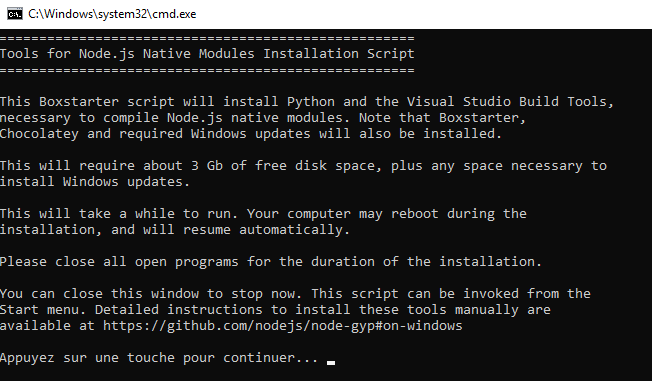

# Installation de node.js
## Préambule :
* L'installation de node servira pour Angular
* La durée d'installation est de 15' approximativement
* Comme il y aura deux redémarrages automatiques, quitter les diférentes applications en cours

## première étape : downoad node.js
[node.js](https://nodejs.org/en/) : choisissez la version 
> 10.13.0 LTS

Suivre l'indication 'Appuyez sur une touche pour continuer ...


## seconde étape : lancement de l'exécutable


## troisième : l'installation se poursuit avec powerShell


```java
int i=0;
```
npm pierre install
PowerShell.png

