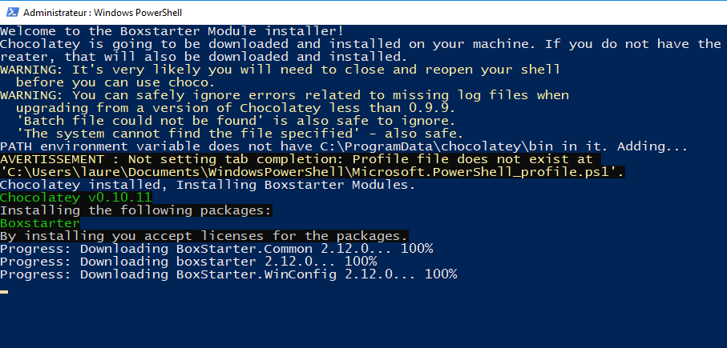

# Installation de node.js
## Préambule :
* L'installation de node servira pour Angular
* La durée d'installation est de 15' approximativement
* Comme il y aura deux redémarrages automatiques, quitter les diférentes applications en cours

## Première étape : downoad node.js
[node.js](https://nodejs.org/en/) : choisissez la version 
> 10.13.0 LTS

## Seconde étape : une fois l'exécutable lancé, suivre l'indication 'Appuyez sur une touche pour continuer ...

## Troisième étape : l'installation se poursuit avec powerShell

## Quatrième étape : après un redémarrage l'installation se poursuit automiquement : 

## Cinquème étape : un second redémarrage intervient : 

## Sixième étape : Attention, il est à noter que l'installation reste pendant un certain temps dans l'état suivant :

## Septième étape : lorsque vous y êtes invité, appuyez sur la touche 'entrée'

## Dernière étape : Lancer une invite de commande et vérifier que node est bien installé

