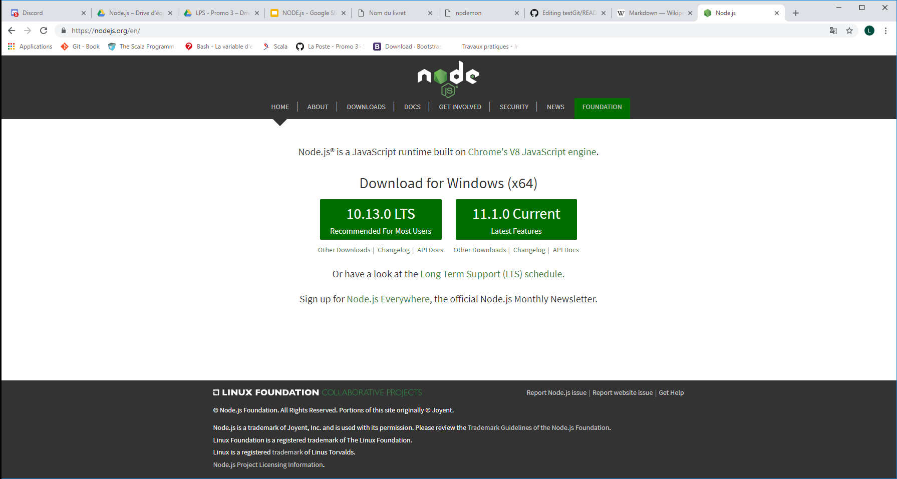

# Installation de node.js
## Préambule :
* La durée d'installation est de 15' approximativement
* Comme il y aura deux redémarrages automatiques, quitter les diférentes applications en cours

## première étape : downoad node.js
[node.js](https://nodejs.org/en/) : choisissez la version 
> 10.13.0 LTS




```java
int i=0;
```
npm pierre install


